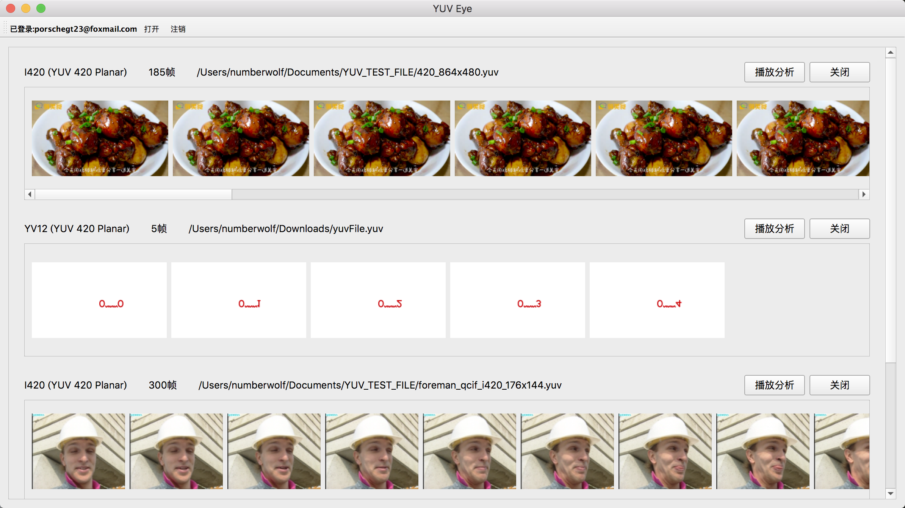
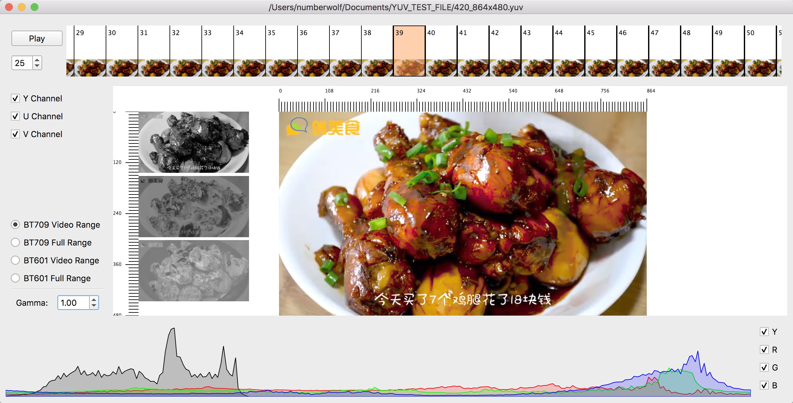
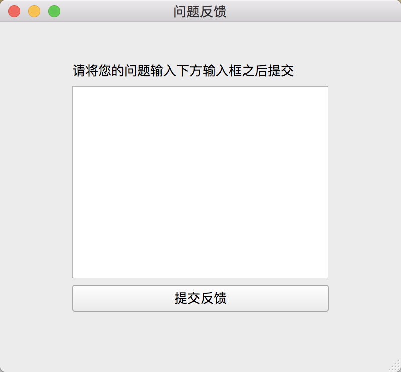
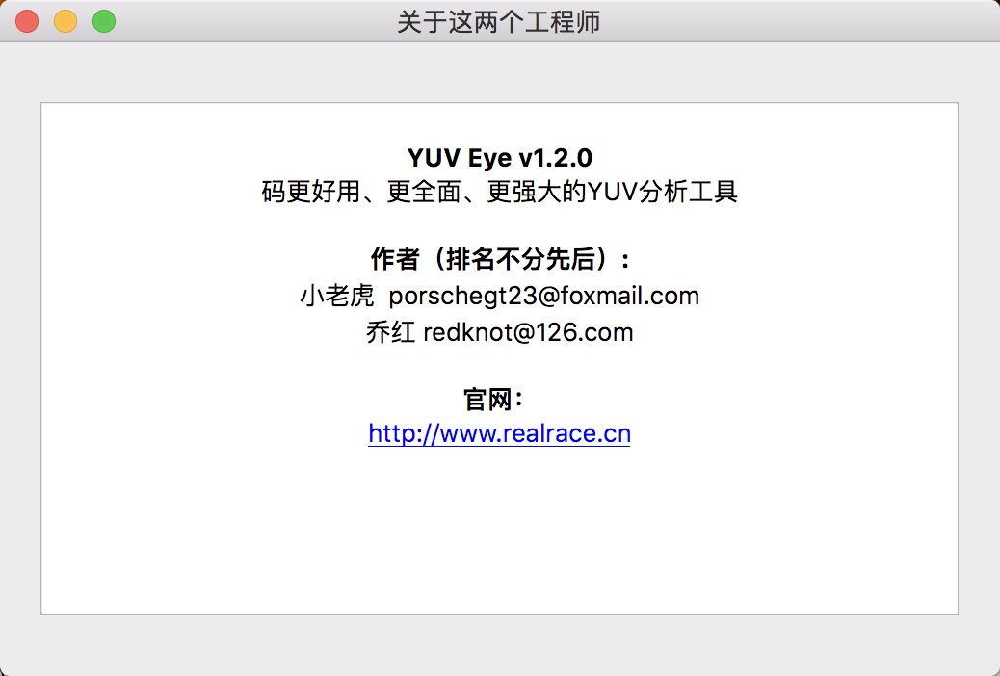

--------------------------------------------------

## 1 介绍
主要用途：播放和分析YUV文件，支持多种格式、多个文件输入               
运行环境：MacOS、Windows             
免费                   

>              

下载地址：http://realrace.cn/#/YuvEye

## 2 所有支持的YUV类型

> 

## 3 使用界面

### 3.1 主页
> 

### 3.2 播放
> 

### 3.3 反馈
> 

### 3.4 关于我们
> 

## 4 联系我们
- 邮箱
   - porschegt23@foxmail.com
   - redknot@126.com
- 技术支持群 : 814462428

